# WGRALGO Guardians of Health &amp; Recovery

Guardians of Health &amp; Recovery is a free educational Android app from The Wealth Gap Resolution Algorithm&trade; Inc. Learn how alcohol and drugs affect the body, how to respond in an emergency, and how to support recovery, for yourself, your family, and your community.

The app is fully offline, contains no ads, no analytics, no trackers, and asks for no permissions.

- **Version:** 2.0.0
- **Devices:** phones and tablets, portrait and landscape
- **Package:** `org.wgralgo.guardianshealthrecovery`
- **License:** GPL-3.0-only

Companion to the web concept at <https://thewealthgapresolutionalgorithm.org/guardians-of-health-recovery/>.

---

## Features

- **90 built-in questions**, 30 per level: **Beginner** (the basics everyone should know), **Everyday** (real-life situations), and **Helper** (for peer supporters and helpers), plus an **All Levels** round.
- Topics: Overdose &amp; Safety, Body &amp; Brain, Alcohol, Medications, Treatment &amp; Recovery, Helping Loved Ones, Helping Skills, Screening &amp; Care, Ethics &amp; Boundaries, Rights &amp; Resources, and Stigma &amp; Language.
- 10 random questions per round, no repeats until the bank runs out, and shuffled answers.
- Instant feedback with a lesson after every answer. **Myth busters** explain the truth when you pick a common myth (41 questions include one).
- Results by topic, a review of every question, and a running total across rounds.
- A **Need help now?** card with 911, 988, the SAMHSA National Helpline, FindTreatment.gov, Poison Control, and 1-800-QUIT-NOW.
- **Looks like a real app:** black launch screen with the big logo, a launcher icon that fills round, squircle, and square shapes, a solid app bar, About / Privacy / Credits panels, and Android back-button support (back asks before quitting a round, returns to the level picker from results, and asks before exiting the app).
- **Phones and tablets, portrait and landscape:** the app rotates freely. On phones turned sideways the start-screen logo is smaller so the game starts on screen; on tablets the answers spread into two columns.
- Fully offline: no internet permission, no network calls. No accounts, no ads, no analytics, no trackers.

## Screenshots

| Launch | Home | Question | Feedback |
|---|---|---|---|
| 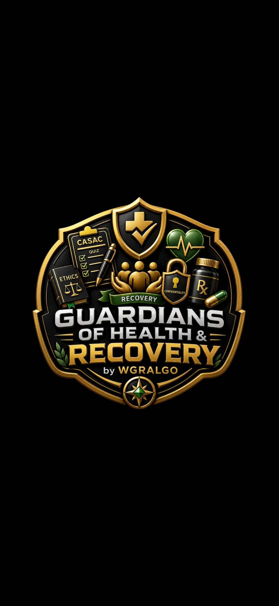 | 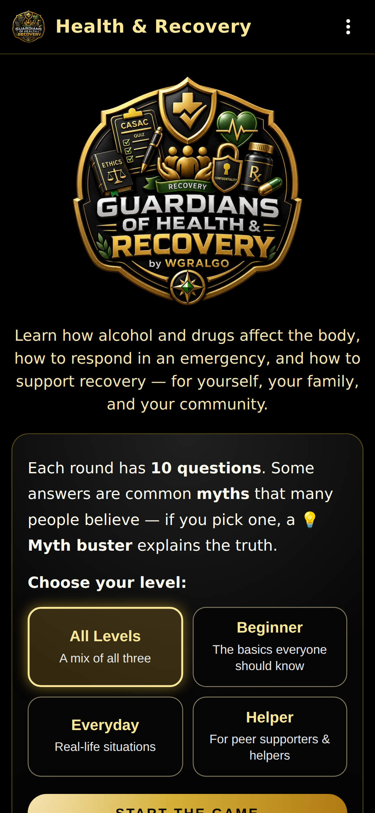 | 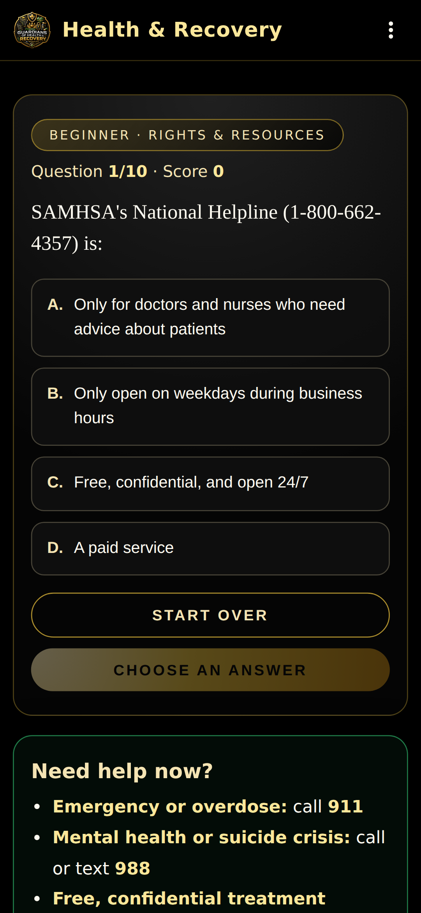 | 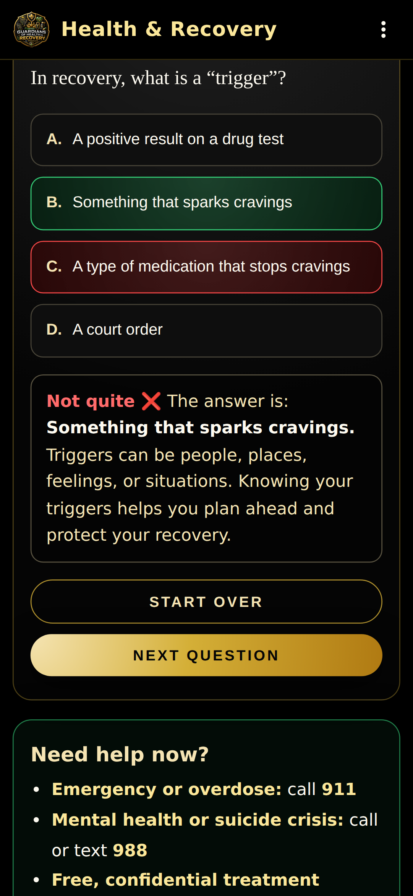 |

| Results | By topic | Menu | About |
|---|---|---|---|
| 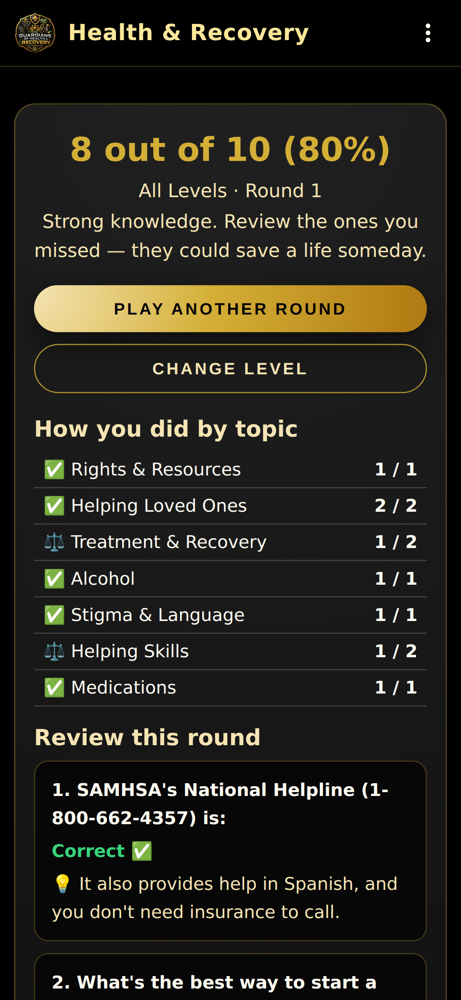 | 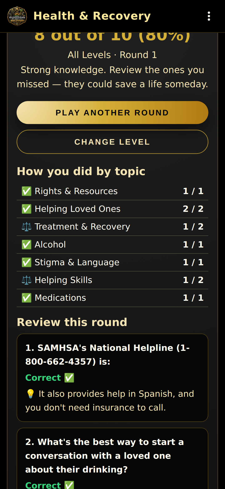 | 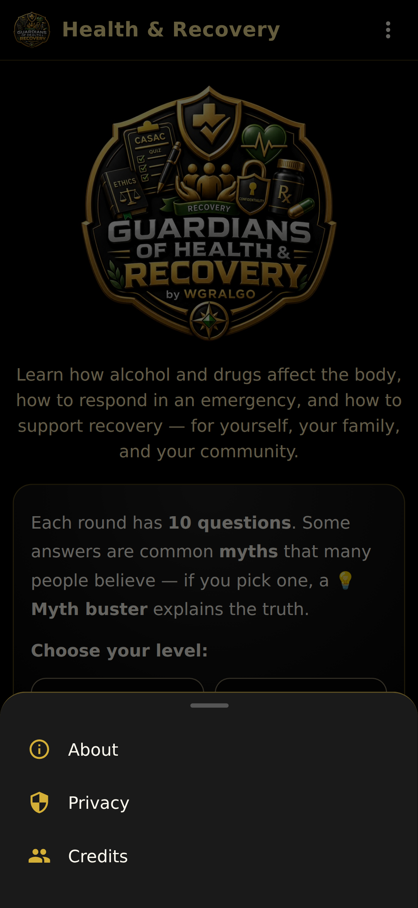 | 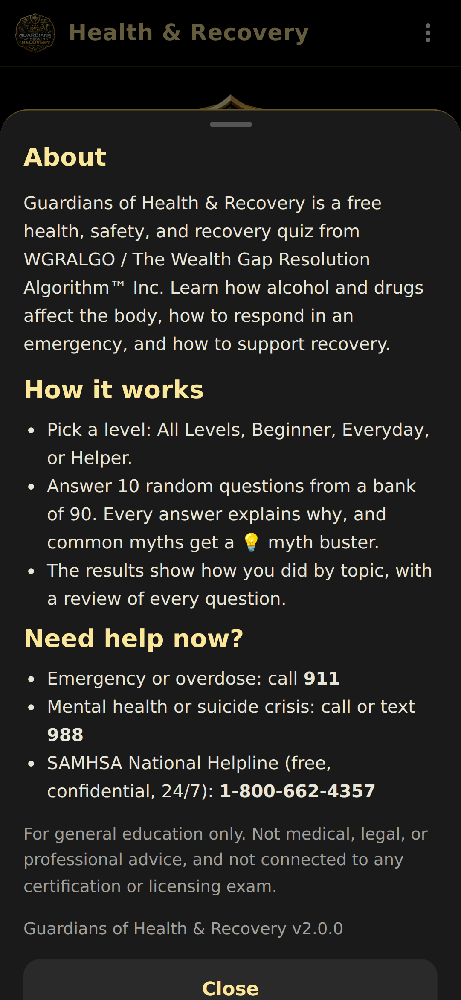 |

Phones and tablets:

| Phone, landscape | Tablet, landscape | Tablet, portrait |
|---|---|---|
| 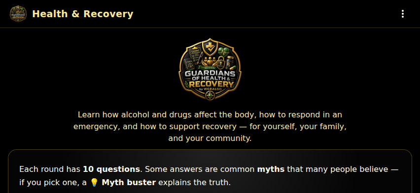 | 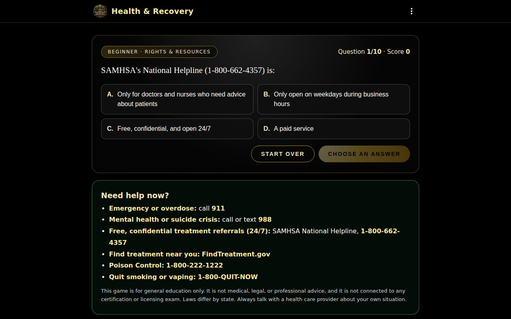 | 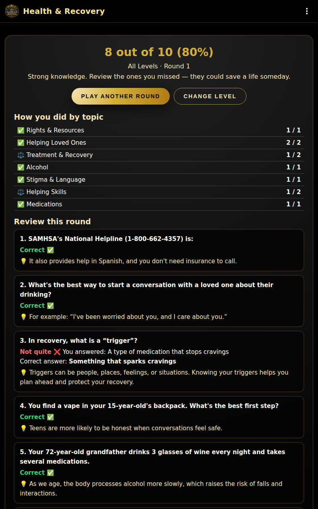 |

## How to install / sideload the APK

1. Download `WGRALGO-GuardiansOfHealthRecovery-v2.0.0.apk` from the [GitHub Releases](../../releases) page.
2. On your Android phone or tablet, allow installs from your browser or file manager (Settings &rarr; Apps &rarr; Special access &rarr; Install unknown apps).
3. Open the downloaded APK and tap **Install**.
4. Optional integrity check (Linux/macOS):
   ```bash
   sha256sum WGRALGO-GuardiansOfHealthRecovery-v2.0.0.apk
   ```
   Compare the output with `WGRALGO-GuardiansOfHealthRecovery-v2.0.0.apk.sha256` from the same release.

> **Upgrading from v1.0.0?** Version 2.0.0 is signed with a new key, so it
> can't install over the old app. Uninstall v1.0.0 first, then install v2.0.0.
> The app saves nothing on your device, so nothing is lost.

### Signing certificate (v2.0.0 and later)

- `CN=WGRALGO, OU=Guardians of Health and Recovery, O=The Wealth Gap Resolution Algorithm Inc, C=US`
- SHA-256: `77:C2:D1:A5:BF:2E:37:F8:9F:24:7C:76:A5:19:70:9C:28:D1:D1:57:F0:3C:1A:C3:65:B0:EB:09:2A:DD:99:AA`

```bash
apksigner verify --print-certs WGRALGO-GuardiansOfHealthRecovery-v2.0.0.apk
```

## How to build from source

Requires Node.js 18+, Java 17, and the Android SDK.

```bash
git clone https://github.com/WGRALGO/WGRALGO-Guardians-of-Health-Recovery.git
cd WGRALGO-Guardians-of-Health-Recovery
npm install
npx cap sync android
cd android
./gradlew assembleDebug
```

The debug APK lands at `android/app/build/outputs/apk/debug/app-debug.apk`.

### Signed release build

Release signing uses `android/keystore.properties` **or** environment variables (`GOHR_KEYSTORE_FILE`, `GOHR_KEYSTORE_PASSWORD`, `GOHR_KEY_ALIAS`, `GOHR_KEY_PASSWORD`). The keystore and its passwords are **never** committed to git.

```bash
npx cap sync android
cd android
./gradlew assembleRelease
```

Output: `android/app/build/outputs/apk/release/app-release.apk`.

Check a build before publishing:

```bash
bash tools/validate-release.sh android/app/build/outputs/apk/release/app-release.apk
```

The launcher icon, splash images, and in-app logo are generated from `assets/icon.png` with `python3 tools/build-icons.py` (run from the repo root).

## Continuous integration and releases

- [`.github/workflows/android.yml`](.github/workflows/android.yml) builds a debug APK on every push and pull request.
- [`.github/workflows/release.yml`](.github/workflows/release.yml) builds, validates, signs, and publishes `WGRALGO-GuardiansOfHealthRecovery-v<version>.apk` with its `.sha256` to GitHub Releases. Run it from the **Actions** tab or push a `v*` tag. It needs these repository secrets: `GOHR_KEYSTORE_BASE64`, `GOHR_KEYSTORE_PASSWORD`, `GOHR_KEY_ALIAS`, `GOHR_KEY_PASSWORD`.

## Privacy summary

- No account required
- No ads
- No analytics
- No trackers
- No cloud upload
- No data selling
- No personal health information is collected
- No quiz answers or scores are sent to WGRALGO
- The app is an offline educational health-and-recovery quiz

Full statement: [PRIVACY.md](./PRIVACY.md).

## Educational disclaimer

Guardians of Health &amp; Recovery is for educational awareness and practice only. It does not provide medical, mental health, legal, counseling, substance use treatment, crisis intervention, or professional certification advice. It does not replace official CASAC coursework, supervision, exam preparation, clinical training, or guidance from qualified professionals. If someone may be experiencing a medical emergency, overdose, withdrawal emergency, or crisis, contact emergency services or a qualified professional immediately.

## License

This project is released under the GNU General Public License v3.0. See [LICENSE](./LICENSE).

## Contributors

See [CONTRIBUTORS.md](./CONTRIBUTORS.md).
